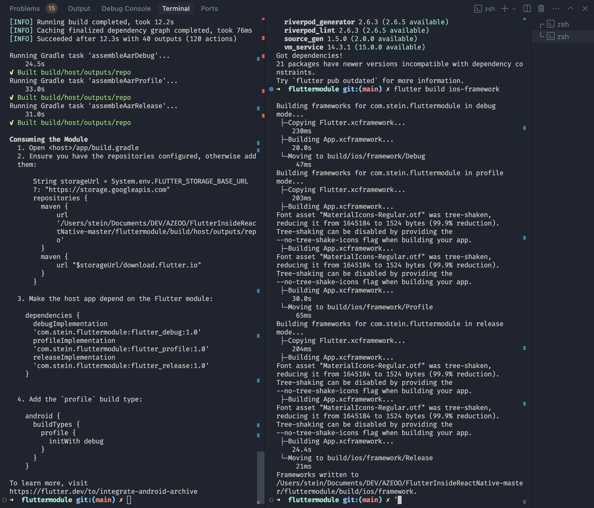

# Flutter Inside React Native

A demonstration project showcasing the integration of a Flutter module within a React Native application. This project implements a profile display feature using Flutter, which can be seamlessly embedded in a React Native app.

## Project Overview

This project demonstrates how to:
- Integrate a Flutter module into a React Native application
- Handle platform-specific implementations for iOS and Android
- Manage state and communication between Flutter and React Native
- Implement a clean architecture with proper separation of concerns

### Architecture

The project follows a clean architecture pattern with the following structure:

```
FlutterInsideReactNative-master/
├── fluttermodule/     # Flutter module
│   ├── lib/
│   │   ├── features/  # Feature-based architecture
│   │   │   └── profile/
│   │   │       ├── data/        # Data layer
│   │   │       ├── domain/      # Domain layer
│   │   │       └── presentation/# Presentation layer
│   │   └── main.dart # Entry point
└── rnapp/            # React Native app
    ├── android/      # Android native code
    ├── ios/         # iOS native code
    └── src/         # React Native source code
```

### Technical Choices

1. **State Management: Riverpod**
   - Chosen for its simplicity and type-safety
   - Provides better dependency injection than Provider
   - Enables easy testing and mocking
   - Supports code generation for reduced boilerplate

2. **API Client: Retrofit**
   - Type-safe HTTP client for API communication
   - Automatic JSON serialization/deserialization
   - Supports interceptors for logging and error handling
   - Easy to maintain and test

3. **Platform Channels**
   - Custom implementation for Flutter-React Native communication
   - Handles bidirectional data flow
   - Manages lifecycle events properly

## Prerequisites

- Flutter SDK (3.7.0 or higher)
- React Native CLI
- Android Studio / Xcode
- Node.js & npm
- CocoaPods (for iOS)

## Setup Instructions

### 1. Flutter Module Setup

```bash
# Navigate to the Flutter module directory
cd fluttermodule

# Install Flutter dependencies
flutter pub get

# make sure the env file present or else this will fail
cp fluttermodule/.env.example fluttermodule/.env

# Generate necessary code (models, API clients)
flutter pub run build_runner build --delete-conflicting-outputs

# Build the Flutter module
flutter build aar  # For Android
flutter build ios-framework  # For iOS
```

### 2. React Native App Setup

```bash
# Navigate to the React Native app directory
cd rnapp

# Install dependencies
npm install

# For iOS, install CocoaPods dependencies
cd ios && pod install && cd ..

# For Android, make gradlew executable
cd android && chmod +x gradlew && cd ..
```

### 3. Running the App

```bash
# Start Metro bundler
npm run start

# In a new terminal, run the app
# For Android:
npm run android

# For iOS:
npm run ios
```

### 4. Using the Automated Script

Alternatively, you can use the automated script to handle all setup and running steps:

```bash
# Make the script executable
chmod +x run_app.sh

# For Android
./run_app.sh android

# For iOS
./run_app.sh ios
```

The script will:
- Check for all required prerequisites
- Set up the Flutter module
- Set up the React Native app
- Clear necessary caches
- Start Metro bundler
- Run the app on the specified platform

## Platform-Specific Implementation

### iOS

The iOS implementation includes:
- `FlutterComponentView.swift`: Manages the Flutter view lifecycle
- `FlutterDependencies.swift`: Handles Flutter engine initialization
- `FlutterCacheManager.swift`: Manages Flutter dependencies and method channels
- `FlutterModule.swift`: Handles method calls between React Native and Flutter

### Android

The Android implementation includes:
- `FlutterViewEngine.kt`: Manages Flutter view lifecycle
- `FlutterFrameLayout.kt`: Handles view layout and lifecycle events
- `ReactNativePackage.kt`: Registers native modules and view managers

## Features

1. **Profile Display**
   - Fetches user profile data from the API
   - Displays profile information in a Flutter widget
   - Handles loading and error states

2. **Platform Communication**
   - Bidirectional communication between Flutter and React Native
   - Proper lifecycle management
   - Error handling and logging

3. **State Management**
   - Clean architecture implementation
   - Feature-based organization
   - Dependency injection

## Development Timeline

1. **Initial Setup & Configuration** (~30 minutes)
   - Project structure setup
   - Dependencies configuration
   - Build system setup

2. **Core Development** (~7 hours)
   - API Integration: 1 hour
   - UI Components: 2 hours
   - Platform-specific adaptations: 4 hours (mostly due to the fact that I'm not familiar with Swift and Objective-C)

3. **Testing & Debugging** (~2 hours)
   - Unit tests
   - Integration tests
   - Platform-specific testing

4. **Documentation** (~30 minutes)
   - Code documentation
   - Setup instructions
   - Architecture overview

Total Development Time: ~7 hours

## Screenshots


<br/>


## Troubleshooting

### Common Issues

1. **Build Failures**
   ```bash
   # Clean and rebuild
   flutter clean
   flutter pub get
   flutter pub run build_runner build --delete-conflicting-outputs
   ```

2. **iOS Issues**
   ```bash
   cd ios
   pod deintegrate
   pod install
   cd ..
   ```

3. **Android Issues**
   ```bash
   cd android
   ./gradlew clean
   ./gradlew assembleDebug
   ```

### Metro Bundler Issues

If you encounter "too many open files" error:

```bash
# Increase system limits
echo kern.maxfiles=65536 | sudo tee -a /etc/sysctl.conf
echo kern.maxfilesperproc=65536 | sudo tee -a /etc/sysctl.conf
sudo sysctl -w kern.maxfiles=65536
sudo sysctl -w kern.maxfilesperproc=65536
ulimit -n 65536

# Clear Metro cache
rm -rf $TMPDIR/metro-*
rm -rf $TMPDIR/haste-*
```

## Clear watchman

```bash
watchman watch-del-all
```

## Created by

- [@Puvistyne-tech](https://github.com/Puvistyne-tech)
